# GPX Analyzer - Technical Deep Dive & Architecture Explanation

## Table of Contents

- [Application Overview](#application-overview)
- [System Architecture](#system-architecture)
- [Data Processing Pipeline](#data-processing-pipeline)
- [Signal Processing Algorithms](#signal-processing-algorithms)
- [User Interface Architecture](#user-interface-architecture)
- [Performance Engineering](#performance-engineering)
- [Security & Data Privacy](#security--data-privacy)
- [Testing Strategy](#testing-strategy)
- [Deployment & Scalability](#deployment--scalability)

## Application Overview

### Vision & Purpose

GPX Analyzer is a comprehensive GPS data analysis platform designed to transform raw GPS tracking data into meaningful insights. The application addresses the complex challenge of processing noisy, irregularly sampled GPS data while maintaining both accuracy and performance on mobile devices.

### Core Value Proposition

1. **Advanced Signal Processing**: Implements research-grade algorithms adapted for mobile constraints
2. **Real-time Visualization**: Provides immediate feedback through synchronized multi-chart displays
3. **Comprehensive Analysis**: Combines statistical analysis with interactive visual exploration
4. **Professional Quality**: Maintains accuracy metadata and error propagation throughout processing

### Target Users

- **Outdoor Enthusiasts**: Athletes, hikers, cyclists seeking detailed activity analysis
- **Researchers**: GPS data quality analysts and algorithm developers
- **Developers**: Mobile development professionals studying clean architecture patterns
- **Educators**: Technical instructors demonstrating signal processing concepts

## System Architecture

### High-Level Architecture Overview

The application implements a sophisticated multi-layered architecture combining Clean Architecture principles with feature-based modular design:

```mermaid
graph TB
    subgraph "GPX Analyzer System Architecture"
        subgraph "User Interface Layer"
            UI_MAIN["`**Main Activity**
            - Navigation Host
            - Global Event Coordination
            - Lifecycle Management`"]
            
            UI_FEATURES["`**Feature UIs**
            - Chart Area Management
            - File Selection Interface
            - Interactive Controls`"]
        end
        
        subgraph "Application Layer"
            FEATURES["`**Feature Modules**
            - GPX List Management
            - Chart Visualization
            - Use Case Orchestration`"]
            
            EVENTS["`**Global Event System**
            - RxJava Event Bus
            - Cross-Feature Communication
            - State Synchronization`"]
        end
        
        subgraph "Business Logic Layer"
            DOMAIN_SERVICES["`**Domain Services**
            - GPX File Processing
            - Signal Processing Pipeline
            - Statistical Analysis`"]
            
            ALGORITHMS["`**Core Algorithms**
            - Extrema Detection
            - Trend Analysis
            - Cumulative Statistics`"]
        end
        
        subgraph "Infrastructure Layer"
            CORE_DATA["`**Core Data**
            - GPX Parsing
            - Caching System
            - Network Integration`"]
            
            CORE_UI["`**Core UI Components**
            - Chart Framework
            - Map Components
            - FAB Controls`"]
            
            UTILITIES["`**Utilities & DI**
            - Location Calculations
            - File Operations
            - Dependency Injection`"]
        end
        
        subgraph "External Systems"
            STORAGE["`**Device Storage**
            - GPX Files
            - Cache Storage
            - Database`"]
            
            APIS["`**External APIs**
            - Altitude Services
            - Geocoding APIs
            - Map Tiles`"]
        end
    end
    
    UI_MAIN --> UI_FEATURES
    UI_FEATURES --> FEATURES
    FEATURES --> EVENTS
    FEATURES --> DOMAIN_SERVICES
    DOMAIN_SERVICES --> ALGORITHMS
    ALGORITHMS --> CORE_DATA
    CORE_DATA --> CORE_UI
    CORE_UI --> UTILITIES
    
    CORE_DATA --> STORAGE
    CORE_DATA --> APIS
    
    EVENTS -.->|"Cross-cutting"| FEATURES
    EVENTS -.->|"State Sync"| UI_FEATURES
    
    classDef uiLayer fill:#e3f2fd,stroke:#1565c0,stroke-width:2px
    classDef appLayer fill:#e8f5e8,stroke:#2e7d32,stroke-width:2px
    classDef domainLayer fill:#fff3e0,stroke:#ef6c00,stroke-width:2px
    classDef infraLayer fill:#fce4ec,stroke:#c2185b,stroke-width:2px
    classDef externalLayer fill:#f3e5f5,stroke:#7b1fa2,stroke-width:2px
    
    class UI_MAIN,UI_FEATURES uiLayer
    class FEATURES,EVENTS appLayer
    class DOMAIN_SERVICES,ALGORITHMS domainLayer
    class CORE_DATA,CORE_UI,UTILITIES infraLayer
    class STORAGE,APIS externalLayer
```

### Architectural Patterns

#### 1. Clean Architecture Implementation

The application strictly adheres to Clean Architecture principles:

**Dependency Rule**: Dependencies point inward toward the domain layer
**Independence**: Business logic is independent of frameworks and external concerns
**Testability**: Each layer can be tested in isolation

#### 2. Feature-Based Modular Design

Features are organized as vertical slices cutting across all architectural layers:

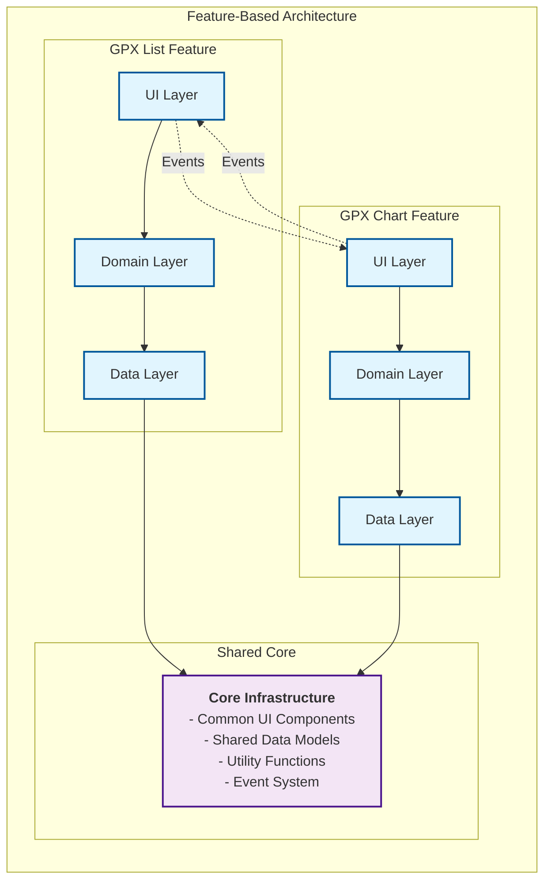

#### 3. Event-Driven Architecture

Global event system enables loose coupling between features:

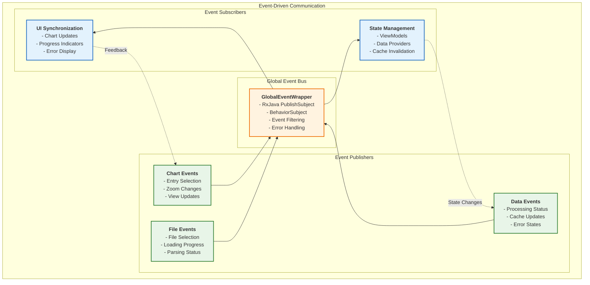

## Data Processing Pipeline

### Comprehensive Data Flow

The application processes GPX data through a sophisticated multi-stage pipeline designed for accuracy, performance, and reliability:

```mermaid
graph TB
    subgraph "Complete Data Processing Pipeline"
        subgraph "Input Stage"
            GPX_INPUT["`**GPX Files**
            - Device Storage Scan
            - User File Selection
            - Format Validation`"]
            
            METADATA["`**Metadata Extraction**
            - Creator Information
            - Track Statistics
            - Waypoint Data
            - Temporal Bounds`"]
        end
        
        subgraph "Parsing Stage"
            XML_PARSE["`**XML Parsing**
            - SAX Parser Implementation
            - Memory-Efficient Processing
            - Error Recovery
            - Validation`"]
            
            ENTITY_CREATE["`**Entity Creation**
            - DataEntity Objects
            - Coordinate Validation
            - Accuracy Assessment
            - Temporal Ordering`"]
        end
        
        subgraph "Processing Stage"
            FILTER["`**Quality Filtering**
            - Accuracy Thresholds
            - Temporal Validation
            - Outlier Detection
            - Consistency Checks`"]
            
            SMOOTH["`**Signal Smoothing**
            - Wavelet Analysis
            - Adaptive Filtering
            - Noise Reduction
            - Feature Preservation`"]
            
            EXTREMA["`**Extrema Detection**
            - Derivative Analysis
            - Peak/Valley Finding
            - Segment Creation
            - Trend Classification`"]
        end
        
        subgraph "Analysis Stage"
            STATISTICS["`**Statistical Analysis**
            - Cumulative Calculations
            - Trend Statistics
            - Accuracy Propagation
            - Error Estimation`"]
            
            SEGMENTS["`**Segment Analysis**
            - Ascent/Descent Detection
            - Flat Section Identification
            - Distance Calculations
            - Speed Analysis`"]
        end
        
        subgraph "Visualization Stage"
            CHART_DATA["`**Chart Data**
            - Multi-Series Preparation
            - Scale Normalization
            - Color Mapping
            - Interactive Features`"]
            
            MAP_DATA["`**Map Data**
            - Track Overlay Creation
            - Segment Coloring
            - Marker Placement
            - Zoom Level Optimization`"]
        end
        
        subgraph "Caching Layers"
            L1_CACHE["`**L1 Cache**
            - Raw Data Entities
            - Weak References
            - Memory Management`"]
            
            L2_CACHE["`**L2 Cache**
            - Processed Data
            - Lazy Evaluation
            - UI-Specific Views`"]
            
            L3_CACHE["`**L3 Cache**
            - Rendered Elements
            - Bitmap Cache
            - Chart Components`"]
        end
    end
    
    GPX_INPUT --> METADATA
    METADATA --> XML_PARSE
    XML_PARSE --> ENTITY_CREATE
    ENTITY_CREATE --> FILTER
    FILTER --> SMOOTH
    SMOOTH --> EXTREMA
    EXTREMA --> STATISTICS
    STATISTICS --> SEGMENTS
    SEGMENTS --> CHART_DATA
    SEGMENTS --> MAP_DATA
    
    ENTITY_CREATE --> L1_CACHE
    STATISTICS --> L2_CACHE
    CHART_DATA --> L3_CACHE
    MAP_DATA --> L3_CACHE
    
    L1_CACHE -.->|"Cache Hit"| FILTER
    L2_CACHE -.->|"Cache Hit"| CHART_DATA
    L3_CACHE -.->|"Cache Hit"| VISUAL_OUTPUT
    
    VISUAL_OUTPUT["`**Visual Output**
    - Rendered Charts
    - Map Displays
    - User Interface`"]
    
    classDef inputStage fill:#e8f5e8,stroke:#2e7d32,stroke-width:2px
    classDef processingStage fill:#fff3e0,stroke:#ef6c00,stroke-width:2px
    classDef analysisStage fill:#e3f2fd,stroke:#1565c0,stroke-width:2px
    classDef visualStage fill:#fce4ec,stroke:#c2185b,stroke-width:2px
    classDef cacheStage fill:#f3e5f5,stroke:#7b1fa2,stroke-width:2px
    classDef outputStage fill:#e1f5fe,stroke:#01579b,stroke-width:2px
    
    class GPX_INPUT,METADATA inputStage
    class XML_PARSE,ENTITY_CREATE,FILTER,SMOOTH,EXTREMA processingStage
    class STATISTICS,SEGMENTS analysisStage
    class CHART_DATA,MAP_DATA visualStage
    class L1_CACHE,L2_CACHE,L3_CACHE cacheStage
    class VISUAL_OUTPUT outputStage
```

### Data Entity Lifecycle

Each GPS data point follows a well-defined lifecycle through the system:

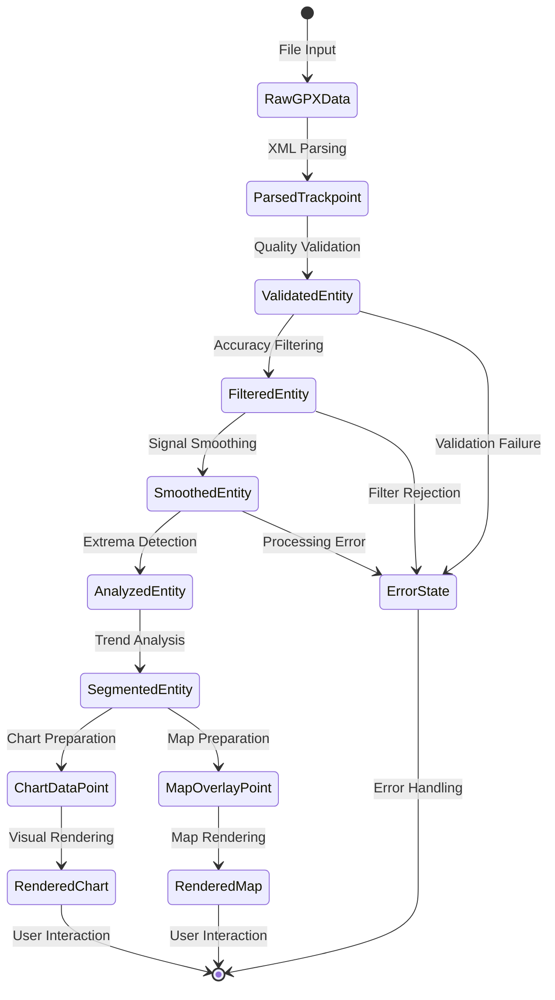

## Signal Processing Algorithms

### Advanced Mathematical Foundation

The application implements research-grade signal processing algorithms specifically adapted for GPS data characteristics:

#### 1. Wavelet-Based Adaptive Smoothing

**Core Algorithm**: Combines discrete wavelet transforms with FFT analysis for optimal noise reduction

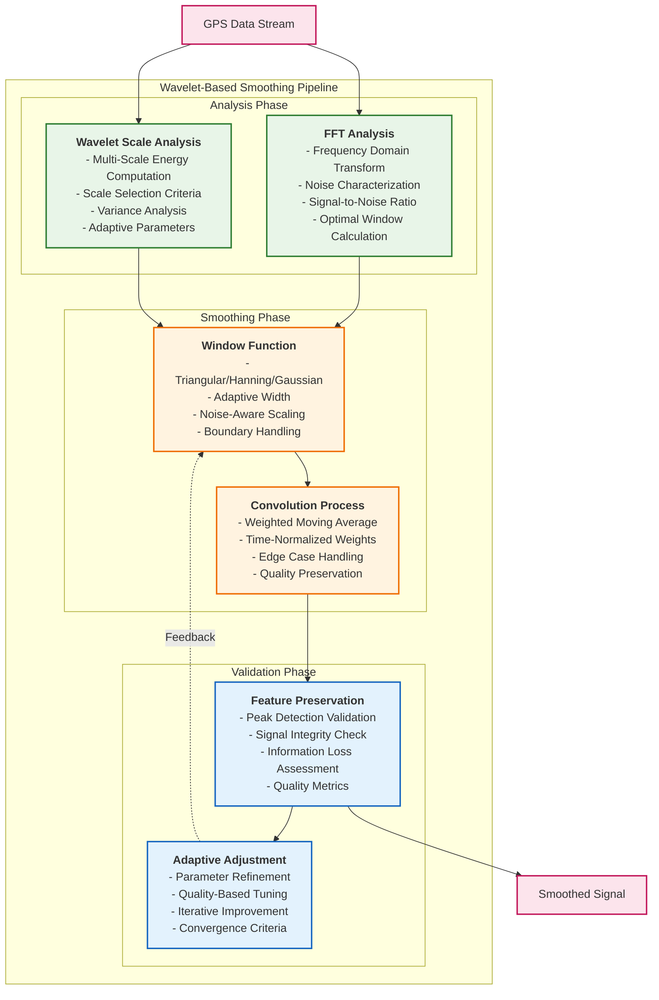

**Mathematical Foundation**:

1. **Energy Scale Computation**:
   ```
   E(s) = (1/(N-s)) * Σ[i=0 to N-s-1] (x[i] - x[i+s])²
   ```

2. **Optimal Lag Calculation**:
   ```
   L_opt = argmin(s) { E(s) + λ * s }
   ```

3. **Adaptive Smoothing Factor**:
   ```
   α = 1 - min(0.8, σ/(10 + σ))
   ```

#### 2. Multi-Stage Extrema Detection

**Algorithm Overview**: Combines derivative analysis with amplitude thresholding for robust extrema identification

```mermaid
graph TB
    subgraph "Extrema Detection Algorithm"
        subgraph "Preprocessing"
            TIME_NORM["`**Time Normalization**
            - Irregular Sample Handling
            - Temporal Interpolation
            - Rate Compensation
            - Consistency Validation`"]
            
            DERIVATIVE["`**Derivative Calculation**
            - Discrete Time Derivatives
            - Central Difference Method
            - Noise-Robust Estimation
            - Boundary Conditions`"]
        end
        
        subgraph "Detection"
            SIGN_CHANGE["`**Sign Change Detection**
            - Zero-Crossing Analysis
            - Epsilon Threshold Handling
            - Noise Immunity
            - False Positive Filtering`"]
            
            AMPLITUDE_CHECK["`**Amplitude Validation**
            - Minimum Peak Height
            - Relative Prominence
            - Local Significance
            - Global Context`"]
        end
        
        subgraph "Refinement"
            BOUNDARY_FIX["`**Boundary Extrema**
            - Start/End Point Handling
            - Missing Extrema Detection
            - Pattern Completion
            - Segment Continuity`"]
            
            GAP_FILL["`**Gap Filling**
            - Missing Segment Creation
            - Interpolation Logic
            - Trend Preservation
            - Consistency Maintenance`"]
        end
        
        subgraph "Segment Formation"
            SEGMENT_CREATE["`**Segment Creation**
            - Extrema-Based Boundaries
            - Trend Classification
            - Statistical Properties
            - Quality Assessment`"]
        end
    end
    
    SMOOTHED_DATA[Smoothed Signal] --> TIME_NORM
    TIME_NORM --> DERIVATIVE
    DERIVATIVE --> SIGN_CHANGE
    SIGN_CHANGE --> AMPLITUDE_CHECK
    AMPLITUDE_CHECK --> BOUNDARY_FIX
    BOUNDARY_FIX --> GAP_FILL
    GAP_FILL --> SEGMENT_CREATE
    SEGMENT_CREATE --> SEGMENTS_OUTPUT[Trend Segments]
    
    classDef preprocessing fill:#e8f5e8,stroke:#2e7d32,stroke-width:2px
    classDef detection fill:#fff3e0,stroke:#ef6c00,stroke-width:2px
    classDef refinement fill:#e3f2fd,stroke:#1565c0,stroke-width:2px
    classDef segmentation fill:#fce4ec,stroke:#c2185b,stroke-width:2px
    classDef inputOutput fill:#f3e5f5,stroke:#7b1fa2,stroke-width:2px
    
    class TIME_NORM,DERIVATIVE preprocessing
    class SIGN_CHANGE,AMPLITUDE_CHECK detection
    class BOUNDARY_FIX,GAP_FILL refinement
    class SEGMENT_CREATE segmentation
    class SMOOTHED_DATA,SEGMENTS_OUTPUT inputOutput
```

#### 3. Statistical Analysis Engine

**Comprehensive Statistics**: Dual-mode cumulative analysis with accuracy propagation

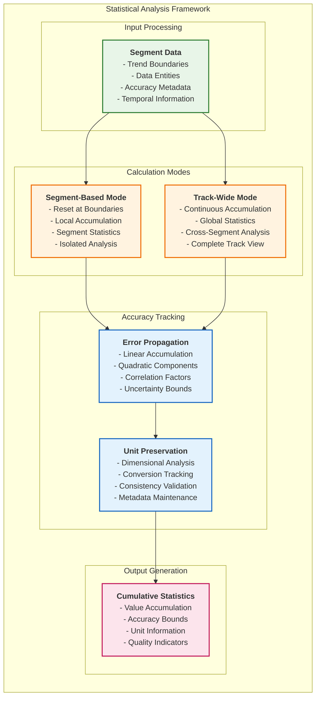

## User Interface Architecture

### Component-Based UI Framework

The UI architecture emphasizes reusability, performance, and maintainability through a sophisticated component hierarchy:

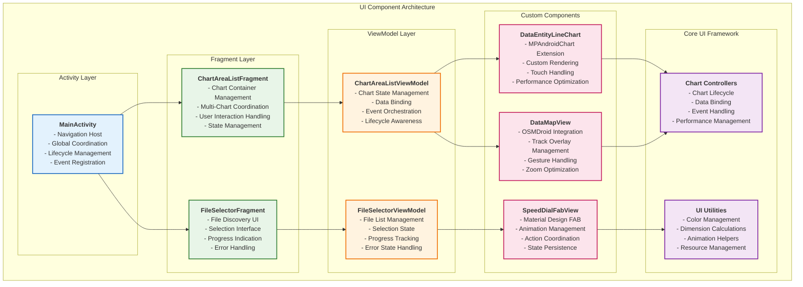

### Real-Time Synchronization System

Advanced synchronization ensures seamless user experience across multiple chart views:

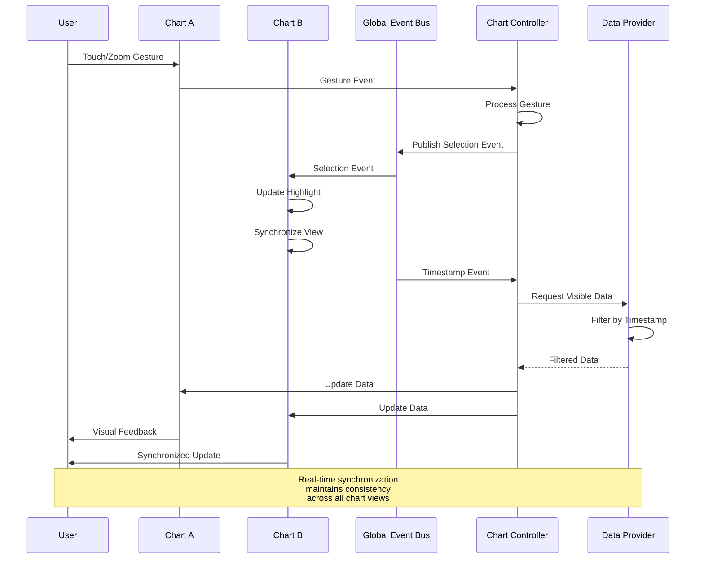

## Performance Engineering

### Multi-Level Optimization Strategy

The application implements comprehensive performance optimizations across all architectural layers:

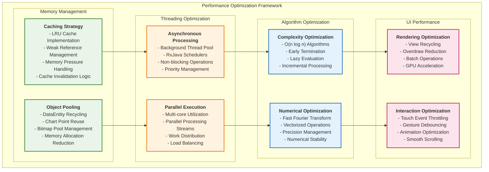

### Performance Monitoring & Metrics

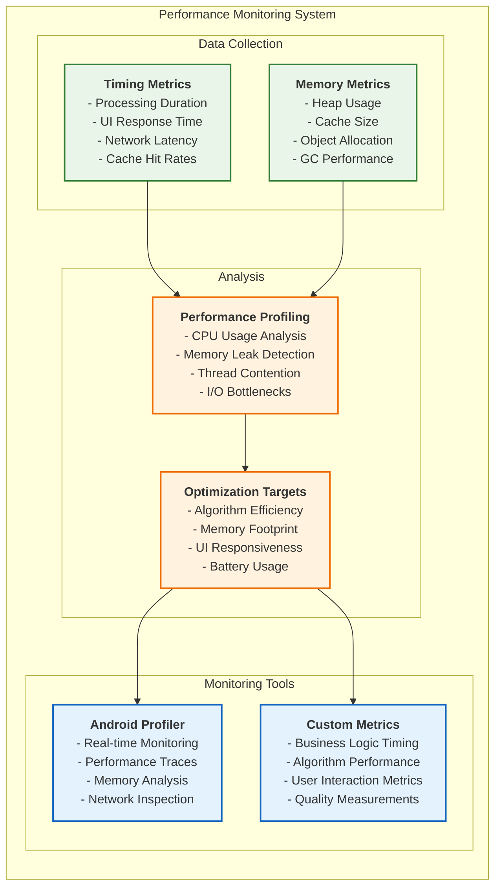

## Security & Data Privacy

### Data Security Framework

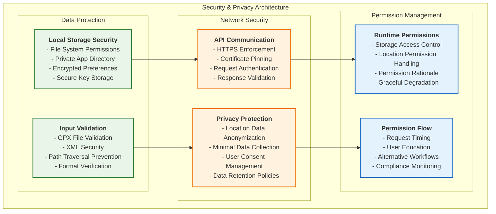

## Testing Strategy

### Comprehensive Testing Framework

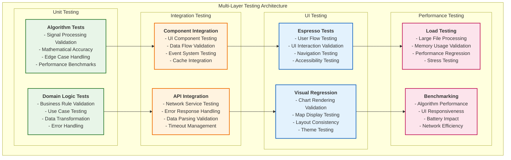

## Deployment & Scalability

### Deployment Architecture

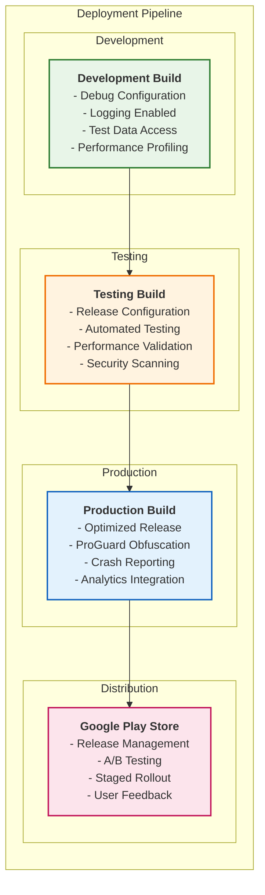

### Scalability Considerations

The application is designed with scalability in mind for future enhancements:

#### **Horizontal Scalability**
- **Modular Architecture**: New features can be added as independent modules
- **Plugin System**: Extensible algorithm framework for custom processing
- **Service-Oriented Design**: Components can be extracted to separate services

#### **Performance Scalability**
- **Streaming Processing**: Handles large datasets through streaming algorithms
- **Incremental Updates**: Processes only changed data for efficiency
- **Cloud Integration**: Ready for cloud-based processing extensions

#### **Feature Scalability**
- **Clean Interfaces**: Well-defined contracts enable easy extension
- **Event-Driven Design**: New features can listen to existing events
- **Dependency Injection**: Runtime configuration and feature toggles

---

**Technical Excellence**: This architecture represents a comprehensive approach to mobile application development, combining advanced algorithms, modern Android practices, and scalable design principles to create a professional-grade GPS analysis platform. 