# Core Module Technical Explanation

This document provides an in-depth technical explanation of the core module's architecture, design patterns, and implementation details. It serves as a comprehensive guide for developers working on or extending the GPX Analyzer application.

## Table of Contents
- [Architecture Patterns](#architecture-patterns)
- [Component Deep Dive](#component-deep-dive)
- [Data Flow & Processing](#data-flow--processing)
- [Event System Architecture](#event-system-architecture)
- [UI Component Framework](#ui-component-framework)
- [Performance Optimizations](#performance-optimizations)
- [Error Handling Strategy](#error-handling-strategy)
- [Testing Architecture](#testing-architecture)

## Architecture Patterns

### Clean Architecture Implementation

The core module implements a variant of Clean Architecture with the following layers:

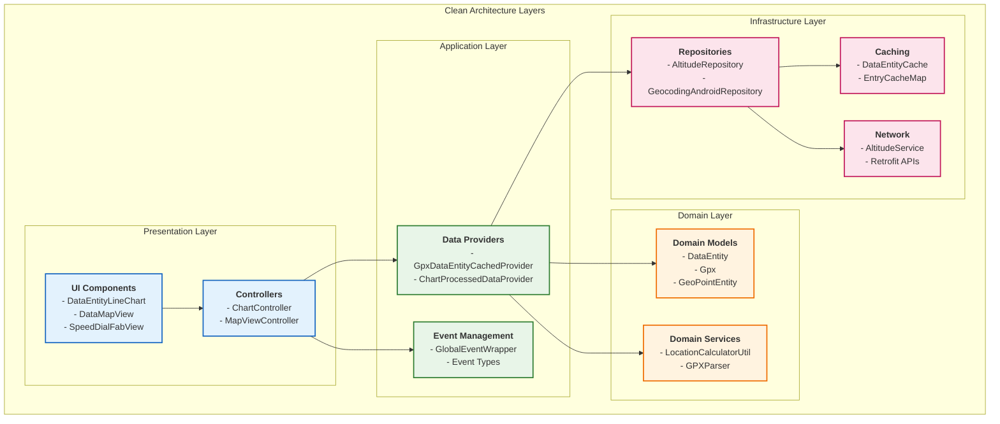

### Dependency Injection Pattern

The module uses Dagger Hilt for comprehensive dependency injection:

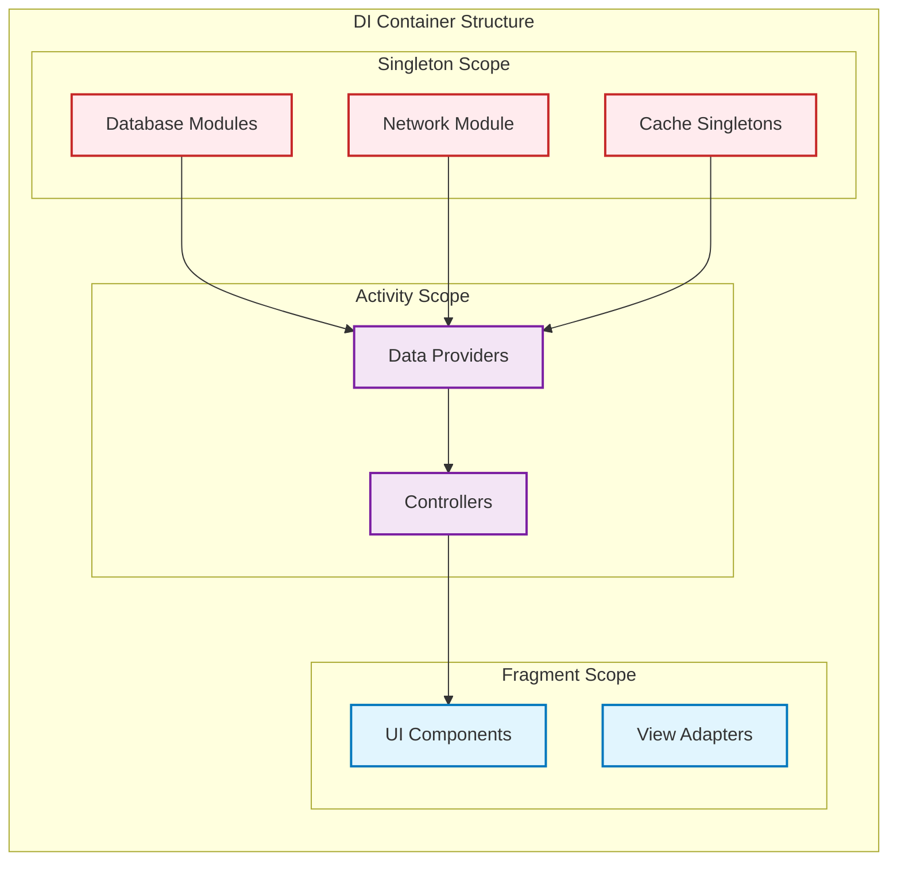

## Component Deep Dive

### Data Layer Architecture

The data layer implements a sophisticated caching and processing pipeline:

```mermaid
graph TD
    subgraph "Data Processing Pipeline"
        INPUT["`**Input Sources**
        - GPX Files (Raw)
        - External APIs
        - User Selections`"]
        
        PARSER["`**Parsing Layer**
        - GPXParser
        - Domain Object Creation
        - Validation`"]
        
        TRANSFORM["`**Transformation Layer**
        - DataEntity Mapping
        - Statistical Processing
        - Coordinate Conversion`"]
        
        CACHE_L1["`**L1 Cache (Raw)**
        - DataEntityCache
        - File-based Caching
        - Memory Management`"]
        
        CACHE_L2["`**L2 Cache (Processed)**
        - ChartProcessedDataCachedProvider
        - UI-specific Processing
        - Lazy Evaluation`"]
        
        OUTPUT["`**Output**
        - Chart Data
        - Map Overlays
        - Statistical Results`"]
    end
    
    INPUT --> PARSER
    PARSER --> TRANSFORM
    TRANSFORM --> CACHE_L1
    CACHE_L1 --> CACHE_L2
    CACHE_L2 --> OUTPUT
    
    CACHE_L1 -.-> TRANSFORM
    CACHE_L2 -.-> OUTPUT
    
    classDef input fill:#e8f5e8,stroke:#2e7d32,stroke-width:2px
    classDef processing fill:#fff3e0,stroke:#ef6c00,stroke-width:2px
    classDef cache fill:#e1f5fe,stroke:#01579b,stroke-width:2px
    classDef output fill:#fce4ec,stroke:#c2185b,stroke-width:2px
    
    class INPUT input
    class PARSER,TRANSFORM processing
    class CACHE_L1,CACHE_L2 cache
    class OUTPUT output
```

### Event System Implementation

The event system uses RxJava for reactive programming patterns:

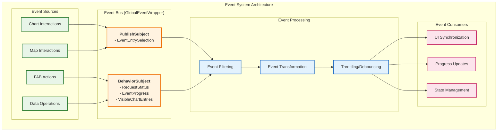

## Data Flow & Processing

### GPX Processing Workflow

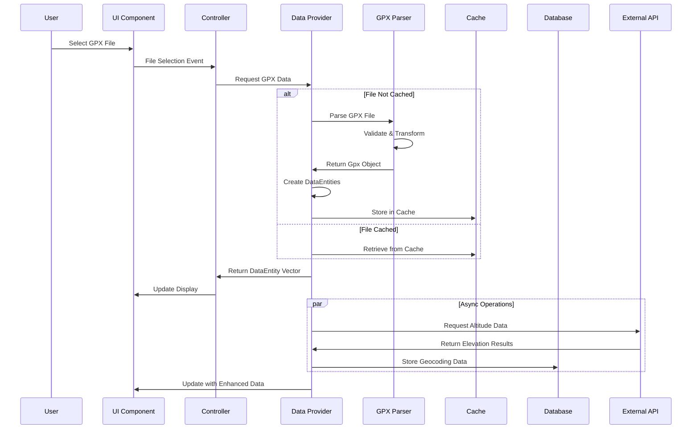

### Chart-Map Synchronization

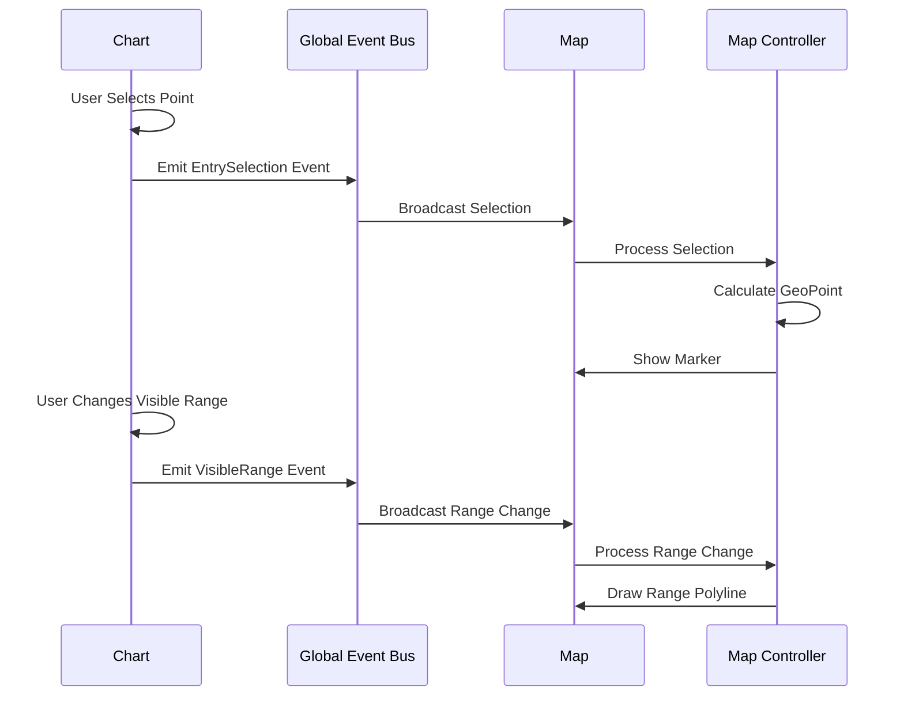

## UI Component Framework

### Chart Component Architecture

The chart components are built on MPAndroidChart with extensive customizations:

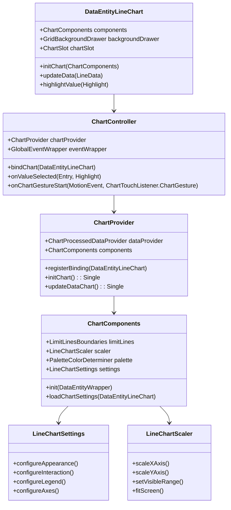

### Map Component Integration

The map components integrate OSMDroid with custom overlay management:

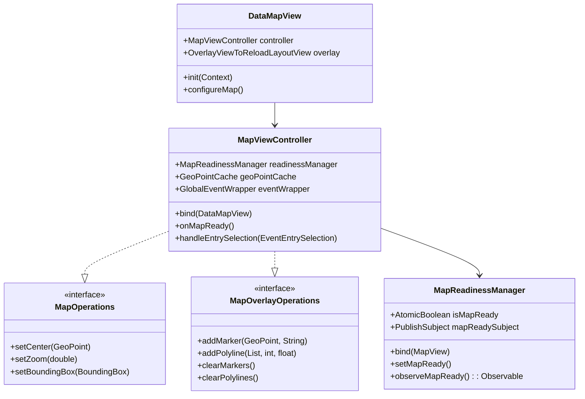

## Performance Optimizations

### Memory Management Strategy

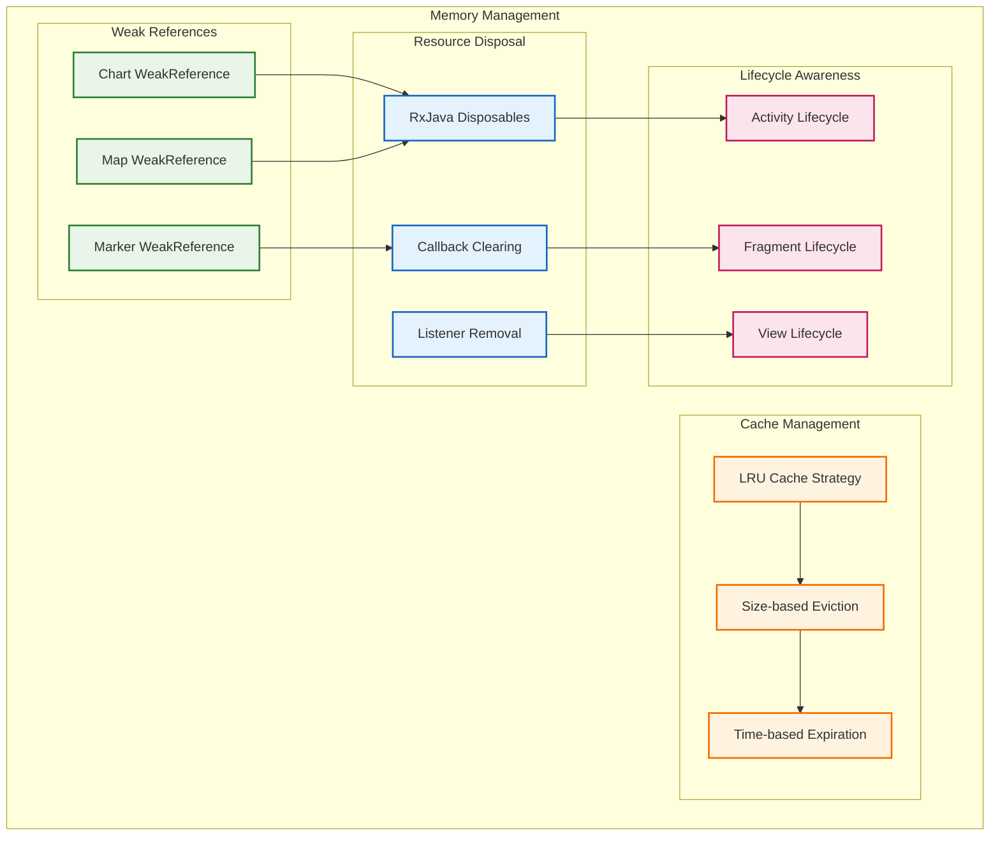

### Async Processing Pipeline

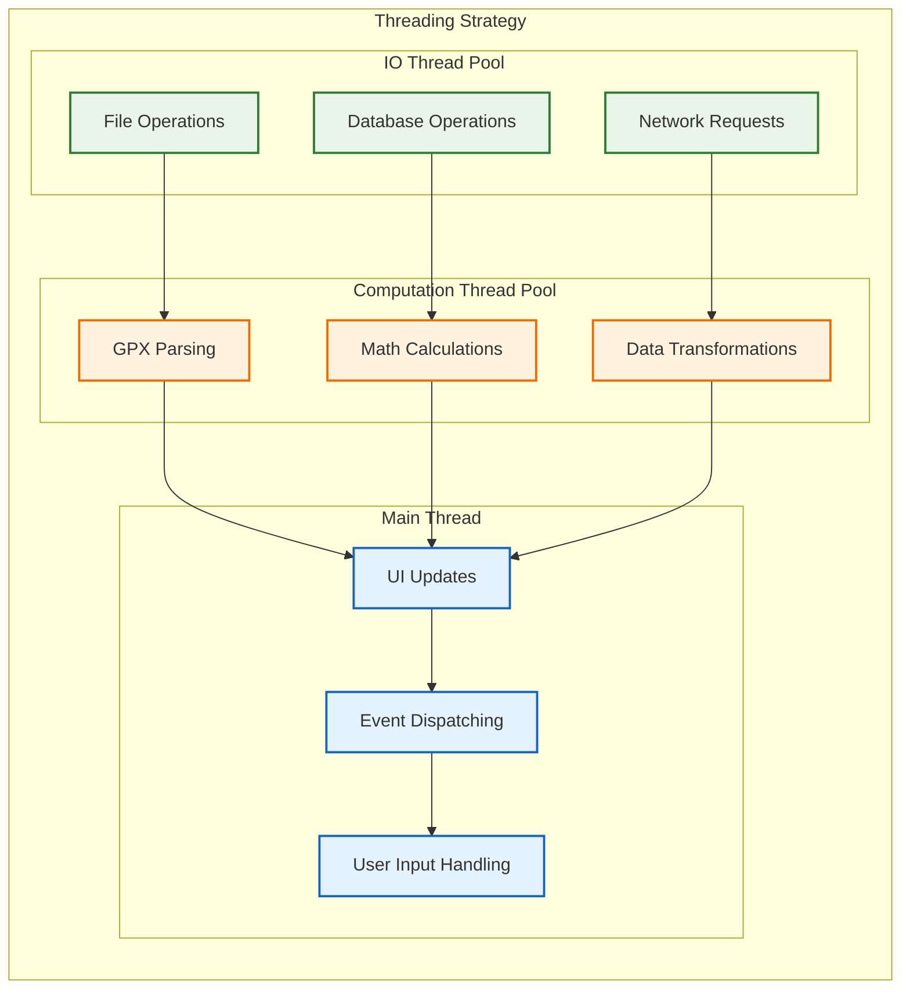

## Error Handling Strategy

### Comprehensive Error Management

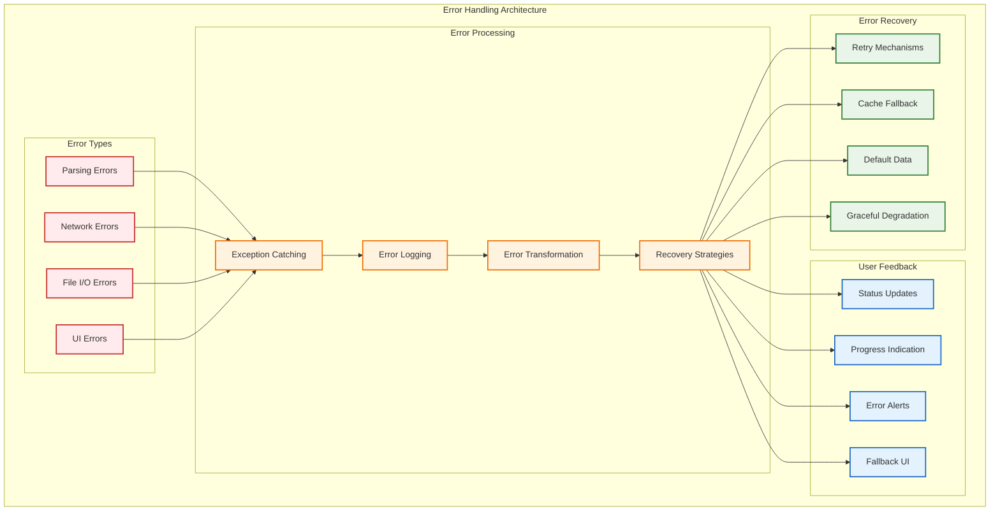

## Testing Architecture

### Testing Strategy Overview

The core module employs a comprehensive testing strategy:

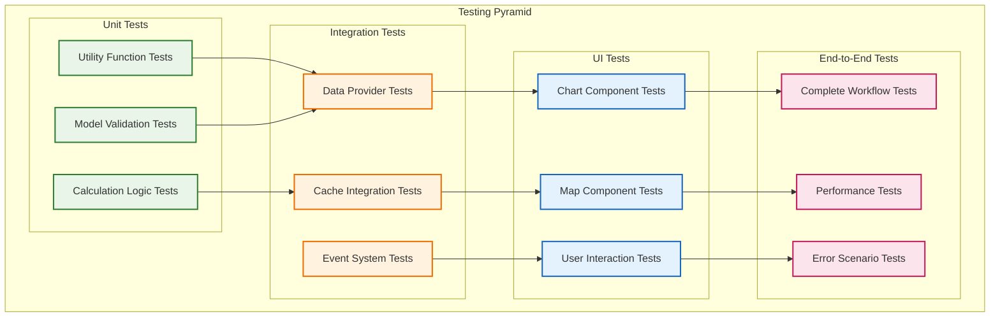

### Mock and Test Double Strategy

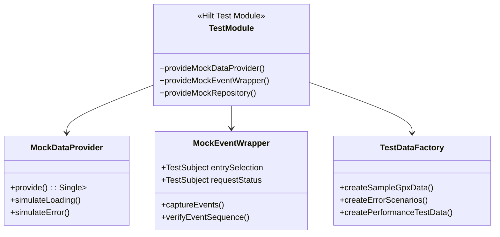

## Key Implementation Insights

### 1. Reactive State Management
The application uses RxJava extensively for managing state changes and ensuring UI consistency. The `GlobalEventWrapper` acts as a central nervous system, coordinating between different components without tight coupling.

### 2. Multi-Level Caching Strategy
The caching system operates on multiple levels:
- **L1 Cache**: Raw parsed data stored in memory
- **L2 Cache**: Processed, UI-ready data with lazy evaluation
- **L3 Cache**: Persistent storage for metadata and preferences

### 3. Component Lifecycle Management
All components are designed to be lifecycle-aware, preventing memory leaks and ensuring proper resource management through weak references and disposable patterns.

### 4. Modular UI Architecture
UI components are designed as self-contained modules with clear interfaces, making them reusable across different features and easy to test in isolation.

### 5. Performance-First Design
The architecture prioritizes performance through async processing, lazy loading, and efficient memory management, ensuring smooth operation even with large GPX files.

---

*This technical explanation provides the foundation for understanding and extending the core module architecture.* 