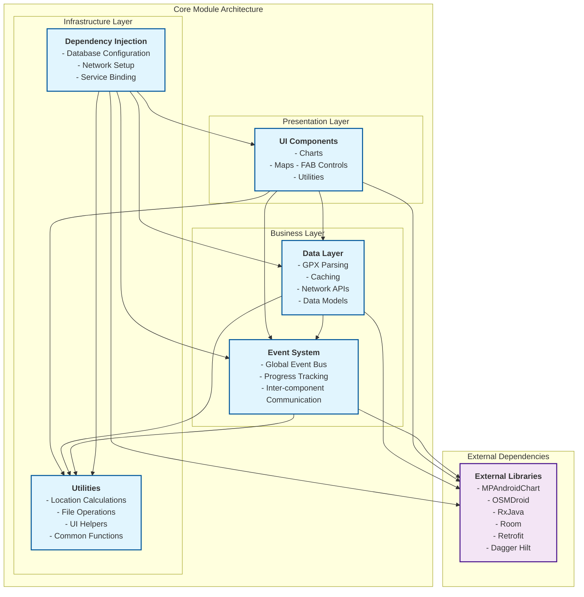
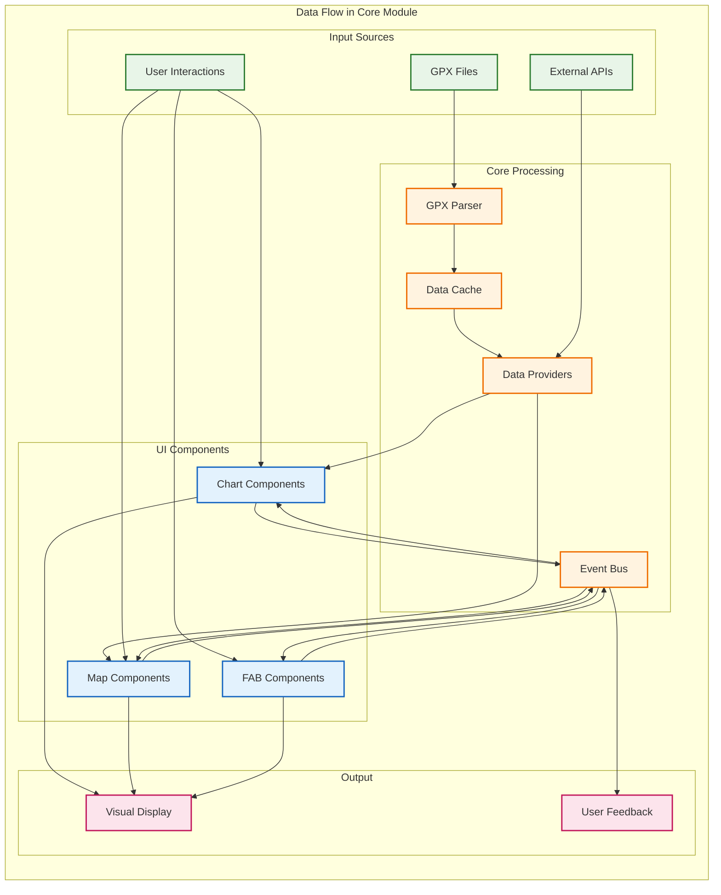

# Core Module (`com.itservices.gpxanalyzer.core`)

The `core` module is the foundational layer of the GPX Analyzer Android application. It provides essential services, utilities, and infrastructure that support all application features. This module implements a clean architecture pattern with clear separation of concerns across data handling, UI components, dependency injection, event management, and common utilities.

## Architecture Overview

The core module is organized into five primary subdirectories, each with distinct responsibilities:

```
core/
├── data/           # Data handling & business logic
├── ui/             # Reusable UI components & utilities  
├── utils/          # Common utility classes
├── events/         # Event bus & inter-component communication
└── di/             # Dependency injection configuration
```

## Module Responsibilities

### 📁 Data Module (`core.data`)
**Primary responsibility**: All data-related operations including GPX file parsing, caching, network requests, and data transformation.

**Key components**:
- **Parser**: GPX file parsing into structured domain objects
- **Cache**: In-memory caching for performance optimization
- **Network**: External API integration (altitude, geocoding)
- **Provider**: Data provisioning with caching strategies
- **Model**: Domain entities and data transfer objects
- **Mapper**: Data transformation between layers

### 🎨 UI Module (`core.ui`)
**Primary responsibility**: Reusable UI components and visual utilities used across the application.

**Key components**:
- **Chart Components**: Advanced MPAndroidChart-based line charts with custom features
- **Map Components**: OSMDroid-based map views with GPX track visualization
- **FAB Components**: Custom floating action buttons with speed dial functionality
- **UI Utils**: Helper classes for styling, formatting, and view operations

### 🔧 Utils Module (`core.utils`)
**Primary responsibility**: Common utility functions and helper classes used throughout the application.

**Key categories**:
- **Location**: Geographic calculations (distance, speed, coordinate transformations)
- **Files**: File operations, permissions, and content URI handling
- **UI**: View manipulation, formatting, color operations
- **Common**: Generic utilities (precision, concurrency, formatting)

### 📡 Events Module (`core.events`)
**Primary responsibility**: Application-wide event bus for decoupled inter-component communication.

**Key components**:
- **GlobalEventWrapper**: Central event bus using RxJava subjects
- **Event Types**: Entry selection, progress updates, chart visibility changes
- **Request Status**: Comprehensive status tracking for async operations

### 💉 DI Module (`core.di`)
**Primary responsibility**: Dependency injection configuration using Dagger Hilt.

**Key modules**:
- **Database Modules**: Room database configuration
- **Network Module**: Retrofit and OkHttp setup
- **Service Modules**: Business service configuration

## Core Architecture Diagram



## Data Flow Architecture



## Key Features

### 🔄 Reactive Programming
- **RxJava Integration**: Extensive use of observables for asynchronous operations
- **Event-Driven Architecture**: Decoupled communication between components
- **Real-time Updates**: Live synchronization between charts and maps

### ⚡ Performance Optimization
- **Multi-level Caching**: Raw data, processed data, and UI-specific caches
- **Lazy Loading**: On-demand data processing and UI updates
- **Memory Management**: Weak references and proper disposal patterns

### 🎯 Modular Design
- **Single Responsibility**: Each module has a clear, focused purpose
- **Dependency Injection**: Loose coupling through Hilt
- **Interface-Based**: Abstract contracts for easy testing and mocking

### 📱 Mobile-First Approach
- **Android Lifecycle Aware**: Proper handling of activity/fragment lifecycles
- **Permission Management**: Comprehensive Android permission handling
- **Storage Access**: Support for different Android API levels and storage models

## Usage Examples

### Accessing GPX Data
```java
@Inject
GpxDataEntityCachedProvider dataProvider;

// Get GPX data with caching
dataProvider.provide()
    .subscribeOn(Schedulers.io())
    .observeOn(AndroidSchedulers.mainThread())
    .subscribe(dataEntities -> {
        // Process GPX data
    });
```

### Listening to Events
```java
@Inject
GlobalEventWrapper eventWrapper;

// Listen for chart entry selections
eventWrapper.getEventEntrySelection()
    .subscribe(selection -> {
        // Handle selection event
    });
```

### Using UI Components
```java
// Chart component
DataEntityLineChart chart = findViewById(R.id.chart);
chartController.bindChart(chart);

// Map component  
DataMapView mapView = findViewById(R.id.map);
// Map automatically binds to controller via DI
```

## Testing Strategy

The core module is designed with testability in mind:

- **Dependency Injection**: All dependencies can be mocked
- **Interface Contracts**: Clear boundaries for unit testing
- **Observable Patterns**: Easy to test reactive streams
- **Utility Classes**: Static methods for pure function testing

## Integration with Feature Modules

The core module serves as the foundation for feature modules:

- **GPX List Feature**: Uses data providers and file utilities
- **GPX Chart Feature**: Leverages chart components and event system
- **Common Patterns**: All features share the same architectural principles

## Future Enhancements

- **Plugin Architecture**: Support for custom data processors
- **Offline Capabilities**: Enhanced caching for offline usage  
- **Performance Monitoring**: Built-in performance tracking
- **Theme System**: Comprehensive theming support

---

*This documentation reflects the current architecture and will be updated as the module evolves.* 