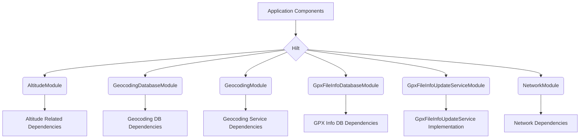

# Dependency Injection (DI) Package Explanation

This package is responsible for managing dependencies within the GpxAnalyzer application using Hilt, a dependency injection library for Android.

## Components

The `di` package contains Hilt modules that provide instances of various dependencies needed throughout the application. Each module is responsible for a specific set of related dependencies.

*   **`AltitudeModule.java`**: Provides a Retrofit instance of `AltitudeService` for fetching altitude data from a network API.
*   **`GeocodingDatabaseModule.java`**: Provides a singleton instance of `GeocodingDatabase`, which is a Room database used for caching geocoding results.
*   **`GeocodingModule.java`**: Provides dependencies for network-based geocoding. This includes a Retrofit `GeocodingService`, API keys (`@GeocodingApiKeys List<String>`, `@GeocodingApiKey String`), and two repository implementations: `GeocodingNetworkRepository` (a basic version) and `GeocodingNetworkRouterRepository` (for distributing requests across multiple API keys).
*   **`GpxFileInfoDatabaseModule.java`**: Provides a singleton instance of `GpxFileInfoDatabase`, a Room database for storing metadata and information about GPX files.
*   **`GpxFileInfoUpdateServiceModule.java`**: Provides the concrete implementation (`GpxFileInfoUpdateServiceImpl`) of the `GpxFileInfoUpdateService` interface, making it available for injection.
*   **`NetworkModule.java`**: Provides a shared `OkHttpClient` instance (configured with an HTTP logging interceptor for development) and a `Gson` instance for JSON serialization/deserialization.

## Architecture

The `di` package leverages Hilt to manage dependencies. Hilt simplifies DI in Android by providing containers for every Android class in your project and managing their lifecycles automatically. Modules define how to provide instances of different types.

*(Diagram illustrates how Hilt uses various modules to provide dependencies to application components.)* 