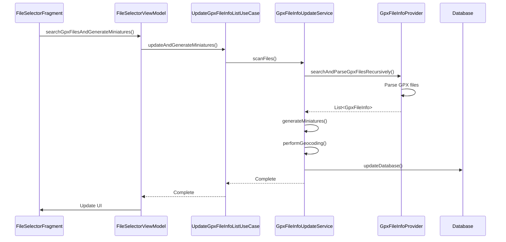
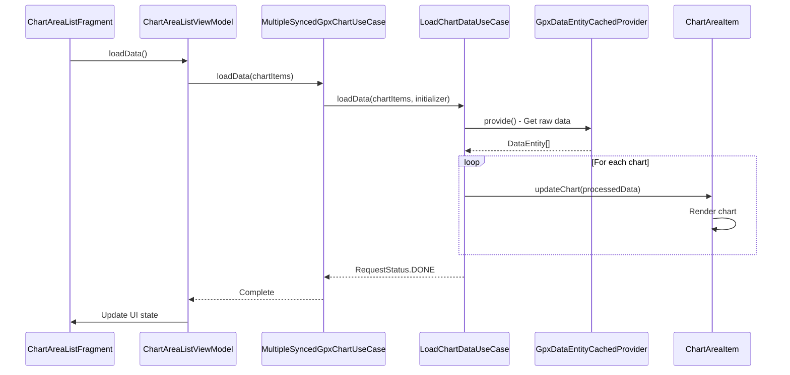

# Feature Module - Technical Deep Dive

## Architectural Philosophy

The Feature module embodies the principles of **Feature-Based Architecture** combined with **Clean Architecture**. This approach provides several key benefits:

### Feature Isolation
Each feature (`gpxlist`, `gpxchart`) is self-contained with its own:
- Data models and business logic
- User interface components
- Dependency injection modules
- Testing infrastructure

### Vertical Slicing
Rather than horizontal layers, features are organized as vertical slices that cut across all architectural layers:
```
gpxlist/
├── data/     ← Data Access Layer
├── domain/   ← Business Logic Layer  
└── ui/       ← Presentation Layer
```

This enables:
- **Independent Development**: Teams can work on different features simultaneously
- **Easier Testing**: Each feature can be tested in isolation
- **Modular Deployment**: Features can be enabled/disabled independently
- **Clear Ownership**: Each feature has well-defined boundaries and responsibilities

## Design Patterns and Principles

### 1. Clean Architecture Implementation

#### Dependency Rule
Dependencies flow inward: UI → Domain → Data

```java
// ✅ Correct: UI depends on Domain
public class FileSelectorViewModel {
    @Inject
    GetGpxFileInfoListUseCase getGpxFileInfoListUseCase; // Domain layer
}

// ✅ Correct: Domain depends on Data (through interfaces)
public class GetGpxFileInfoListUseCase {
    @Inject
    GpxFileInfoProvider gpxFileInfoProvider; // Data layer interface
}

// ❌ Wrong: Domain depending on UI would violate the rule
```

#### Layer Responsibilities

**Domain Layer (Use Cases)**
- Contains business rules and application logic
- Framework-independent
- Defines interfaces for data access
- Orchestrates data flow between layers

**Data Layer (Providers/Repositories)**
- Implements domain interfaces
- Handles data persistence and retrieval
- Manages external data sources (files, network, database)
- Provides caching and data transformation

**UI Layer (ViewModels/Fragments)**
- Handles user interactions
- Manages UI state and lifecycle
- Coordinates with domain layer through use cases
- Implements Android-specific UI logic

### 2. Use Case Pattern

Each feature operation is encapsulated in a dedicated use case:

```java
@Singleton
public class UpdateGpxFileInfoListUseCase {
    // Single responsibility: Update GPX file list with miniatures and geocoding
    public Completable updateAndGenerateMiniatures(Context context, MiniatureMapView renderer) {
        return gpxFileUpdateService.scanFiles(context)
            .flatMapCompletable(files -> {
                return Completable.concatArray(
                    gpxFileUpdateService.generateMiniatures(files),
                    gpxFileUpdateService.performGeocoding(files),
                    gpxFileUpdateService.updateDatabase(files)
                );
            });
    }
}
```

**Benefits**:
- **Single Responsibility**: Each use case handles one business operation
- **Testability**: Easy to unit test business logic
- **Reusability**: Use cases can be composed and reused
- **Clear API**: Well-defined inputs and outputs

### 3. Repository Pattern

Data access is abstracted through provider interfaces:

```java
// Domain defines the contract
public interface GpxFileInfoProvider {
    Single<List<GpxFileInfo>> getAllGpxFilesFromDb();
    Single<List<GpxFileInfo>> searchAndParseGpxFilesRecursively(Context context);
}

// Data layer implements the contract
@Singleton
public class GpxFileInfoProvider implements GpxFileInfoProvider {
    // Implementation details hidden from domain layer
}
```

### 4. MVVM Pattern in UI Layer

ViewModels act as the bridge between UI and domain layers:

```java
@HiltViewModel
public class FileSelectorViewModel extends ViewModel {
    // UI state management
    private final MutableLiveData<List<GpxFileInfo>> fileInfoListLiveData = new MutableLiveData<>();
    
    // Domain interaction
    @Inject
    UpdateGpxFileInfoListUseCase updateGpxFileInfoListUseCase;
    
    // UI operations trigger domain logic
    public void searchGpxFilesAndGenerateMiniatures(Context context, MiniatureMapView renderer) {
        updateGpxFileInfoListUseCase.updateAndGenerateMiniatures(context, renderer)
            .subscribe(/* handle results */);
    }
}
```

## Inter-Feature Communication

### Global Event System

Features communicate through a global event bus rather than direct dependencies:

```java
@Singleton
public class GlobalEventWrapper {
    private final PublishSubject<RequestStatus> requestStatusSubject = PublishSubject.create();
    private final PublishSubject<EventProgress> eventProgressSubject = PublishSubject.create();
    
    public void onNext(RequestStatus status) {
        requestStatusSubject.onNext(status);
    }
    
    public Observable<RequestStatus> getRequestStatus() {
        return requestStatusSubject;
    }
}
```

**Event Types**:
- **RequestStatus**: Loading, processing, completed states
- **EventProgress**: Progress updates for long-running operations
- **EventEntrySelection**: Chart selection events
- **EventVisibleChartEntriesTimestamp**: Timestamp-based events

### Benefits of Event-Driven Architecture
1. **Loose Coupling**: Features don't directly depend on each other
2. **Extensibility**: New features can easily listen to existing events
3. **Debugging**: Centralized event logging and monitoring
4. **Testability**: Events can be easily mocked and verified

## Data Flow Architecture

### GPX List Feature Data Flow



### GPX Chart Feature Data Flow



## Caching Strategy

### Multi-Level Caching Architecture

The application implements a sophisticated caching strategy across multiple levels:

#### 1. Raw Data Cache (`DataEntityCache`)
```java
@Singleton
public class DataEntityCache {
    private final AtomicReference<Vector<DataEntity>> cache = new AtomicReference<>();
    
    public void setCache(Vector<DataEntity> data) {
        cache.set(data);
    }
    
    public Vector<DataEntity> getCache() {
        return cache.get();
    }
}
```

#### 2. Processed Data Cache (`RawDataProcessedProvider`)
```java
public class RawDataProcessedProvider {
    private final AtomicReference<RawDataProcessed> cache = new AtomicReference<>();
    
    public Single<RawDataProcessed> provide(DataEntityWrapper wrapper) {
        // Check cache first, compute if needed
        return cacheHit ? Single.just(cached) : computeAndCache(wrapper);
    }
}
```

#### 3. Chart Data Cache (`ChartProcessedDataCachedProvider`)
```java
public class ChartProcessedDataCachedProvider {
    private final Map<String, ChartProcessedData> cache = new ConcurrentHashMap<>();
    
    public ChartProcessedData provide(RawDataProcessed rawData, LineChartSettings settings) {
        String key = generateCacheKey(rawData, settings);
        return cache.get(key);
    }
}
```

### Cache Invalidation Strategy
- **Time-based**: Cache expires after a certain duration
- **Event-based**: Cache invalidated when source data changes
- **Memory-pressure**: LRU eviction when memory is constrained

## Performance Optimizations

### Reactive Streams with RxJava

The application leverages RxJava for efficient asynchronous processing:

```java
public Single<List<GpxFileInfo>> searchAndParseGpxFilesRecursively(Context context) {
    return deviceStorage.searchAndParseFilesRecursively(context, file -> parser.parse(file))
        .map(this::convertToGpxFileInfo)
        .subscribeOn(Schedulers.io())      // Background thread for I/O
        .observeOn(Schedulers.computation()) // CPU-intensive processing
        .observeOn(AndroidSchedulers.mainThread()); // UI updates
}
```

### Thread Management Strategy

**Scheduler Usage**:
- `Schedulers.io()`: File I/O, network requests, database operations
- `Schedulers.computation()`: CPU-intensive calculations, data processing
- `AndroidSchedulers.mainThread()`: UI updates, view manipulation
- `Schedulers.single()`: Background coordination tasks

### Memory Management

#### Weak References
```java
public class GpxFileDataEntityProvider {
    private final WeakReference<Context> contextWeakReference;
    
    @Inject
    public GpxFileDataEntityProvider(@ApplicationContext Context context) {
        contextWeakReference = new WeakReference<>(context);
    }
}
```

#### Bitmap Management
```java
public class GpxFileInfo {
    private final AtomicReference<Bitmap> miniatureBitmap = new AtomicReference<>();
    
    public void setMiniatureBitmap(Bitmap bitmap) {
        Bitmap oldBitmap = miniatureBitmap.getAndSet(bitmap);
        if (oldBitmap != null && !oldBitmap.isRecycled()) {
            oldBitmap.recycle(); // Prevent memory leaks
        }
    }
}
```

## Error Handling Strategy

### Defensive Programming
```java
public Observable<RequestStatus> loadData(List<ChartAreaItem> chartAreaItemList, 
                                        ChartInitializerUseCase chartInitializer) {
    if (chartAreaItemList == null || chartAreaItemList.isEmpty()) {
        Log.w(TAG, "Cannot load data - chart list is null or empty");
        return Observable.just(RequestStatus.ERROR);
    }
    
    return dataEntityCachedProvider.provide()
        .doOnError(throwable -> {
            Log.e(TAG, "Error loading data", throwable);
            eventWrapper.onNext(RequestStatus.ERROR);
        })
        .onErrorResumeNext(throwable -> Single.just(getDefaultData()));
}
```

### Error Recovery Mechanisms
1. **Graceful Degradation**: Provide default values when operations fail
2. **Retry Logic**: Automatic retry for transient failures
3. **User Feedback**: Clear error messages and recovery suggestions
4. **Logging**: Comprehensive error logging for debugging

## Testing Strategy

### Unit Testing Architecture

Each layer has specific testing approaches:

#### Domain Layer Testing
```java
@Test
public void testGetGpxFileInfoList_ReturnsFilteredFiles() {
    // Given
    List<GpxFileInfo> mockFiles = createMockFiles();
    when(mockProvider.getAndFilterGpxFiles()).thenReturn(Single.just(mockFiles));
    
    // When
    TestObserver<List<GpxFileInfo>> testObserver = useCase.getGpxFileInfoList().test();
    
    // Then
    testObserver.assertComplete()
              .assertValue(files -> files.size() == 2)
              .assertValue(files -> files.get(0).creator().equals("Test Creator"));
}
```

#### UI Layer Testing
```java
@Test
public void testSearchButtonClick_TriggersFileSearch() {
    // Given
    viewModel.setSearchResult(mockFileList);
    
    // When
    viewModel.searchGpxFilesAndGenerateMiniatures(context, mockRenderer);
    
    // Then
    verify(mockUpdateUseCase).updateAndGenerateMiniatures(context, mockRenderer);
    assertEquals(View.VISIBLE, viewModel.getLoadingIndicatorVisibility().getValue());
}
```

### Integration Testing
- **Feature-level**: Test complete user scenarios
- **Cross-feature**: Test feature interactions through events
- **Database**: Test data persistence and retrieval

## Dependency Injection Architecture

### Module Organization
```java
@Module
@InstallIn(SingletonComponent.class)
public class GpxListFeatureModule {
    
    @Provides
    @Singleton
    public GpxFileInfoProvider provideGpxFileInfoProvider(
            GpxFileInfoRepository repository) {
        return new GpxFileInfoProvider(repository);
    }
    
    @Provides
    @Singleton
    public GetGpxFileInfoListUseCase provideGetGpxFileInfoListUseCase() {
        return new GetGpxFileInfoListUseCase();
    }
}
```

### Scope Management
- `@Singleton`: Application-wide components (repositories, use cases)
- `@ViewModelScoped`: ViewModel lifecycle components
- `@FragmentScoped`: Fragment lifecycle components
- `@ActivityScoped`: Activity lifecycle components

## Security Considerations

### File Access Security
```java
public boolean checkAndRequestPermissions(FragmentActivity activity) {
    if (PermissionUtils.hasFileAccessPermissions(activity)) {
        return true;
    } else {
        // Request permissions safely
        PermissionUtils.requestFileAccessPermissions(permissionLauncher);
        if (Build.VERSION.SDK_INT >= Build.VERSION_CODES.R && 
            !Environment.isExternalStorageManager()) {
            PermissionUtils.requestManageExternalStoragePermission(activity);
        }
        return false;
    }
}
```

### Data Validation
```java
public GpxFileInfo parse(File file) {
    try {
        Document document = createDocument(file);
        // Validate XML structure before parsing
        if (!isValidGpxDocument(document)) {
            throw new InvalidGpxFormatException("Invalid GPX format");
        }
        return parseValidDocument(document);
    } catch (Exception e) {
        Log.e(TAG, "Error parsing GPX file: " + file.getName(), e);
        return createErrorFileInfo(file);
    }
}
```

## Future Architecture Considerations

### Modularization Strategy
- **Feature Modules**: Separate dynamic feature modules for large features
- **Library Modules**: Extract reusable components to library modules
- **Platform Modules**: Platform-specific implementations

### Scalability Improvements
- **Plugin Architecture**: Allow third-party feature extensions
- **Microservices**: Break down large features into smaller services
- **Event Sourcing**: Implement event sourcing for better traceability

### Performance Enhancements
- **Lazy Loading**: Load features on-demand
- **Prefetching**: Intelligent data prefetching based on user patterns
- **Background Sync**: Synchronize data in background threads 