# Strava API Integration - Technical Implementation Explanation

## Overview

This document provides a detailed technical explanation of the Strava API integration implementation for the GPX Analyzer Android application. The integration demonstrates a **Proof of Concept** using the **Proxy pattern** to seamlessly integrate external API data sources into the existing local file-based architecture.

## Architecture Deep Dive

### Design Pattern: Proxy Pattern

The implementation follows the **Proxy pattern** (GoF behavioral pattern), where `StravaApiFileProvider` acts as a surrogate for the actual data source (Strava API), providing the same interface as local file providers.

```mermaid
graph LR
    subgraph "Client Code"
        CLIENT["`**GpxFileInfoProvider**
        getAndUpdate(ONLINE)`"]
    end
    
    subgraph "Proxy Layer"
        PROXY["`**StravaApiFileProvider**
        🎯 **Proxy Pattern**
        getFiles(Context, Function)`"]
    end
    
    subgraph "Real Subject"
        API["`**Strava API**
        HTTP Endpoints`"]
        CACHE["`**Local Cache**
        GPX Files`"]
    end
    
    CLIENT --> PROXY
    PROXY --> API
    PROXY --> CACHE
    
    classDef client fill:#e3f2fd,stroke:#1565c0
    classDef proxy fill:#fff3e0,stroke:#ef6c00,stroke-width:3px
    classDef subject fill:#ffebee,stroke:#d32f2f
    
    class CLIENT client
    class PROXY proxy
    class API,CACHE subject
```



#### Key Benefits of Proxy Pattern:

1. **Interface Compatibility**: Same method signature as local providers
2. **Transparent Caching**: Client doesn't know about cache implementation
3. **Lazy Loading**: API calls only when needed
4. **Access Control**: Rate limiting and authentication handled transparently
5. **Enhanced Functionality**: Adds logging, error handling, and retry logic

### Component Architecture

```java
// Proxy Interface Compliance
public Single<List<GpxFileInfo>> getFiles(Context context, Function<File, GpxFileInfo> parserFunction)
```

The architecture consists of five main layers:

#### 1. **Service Layer** (`StravaApiService`)
```java
@GET("athlete/activities")
Single<List<StravaActivity>> getAthleteActivities(
    @Header("Authorization") String authorization,
    @Query("per_page") Integer perPage,
    @Query("page") Integer page
);
```

**Responsibilities**:
- Define HTTP endpoints using Retrofit annotations
- Handle request/response serialization
- Type-safe API method definitions

**Technical Details**:
- Uses `Single<T>` return types for RxJava integration
- Supports both GET and POST methods for different data sizes
- Authorization header injection for OAuth2 Bearer tokens

#### 2. **Data Models** (`model/` package)

**StravaActivity Model**:
```java
public class StravaActivity {
    @SerializedName("id")
    private Long id;
    
    @SerializedName("start_latlng")
    private Float[] startLatLng;
    
    public boolean hasGpsData() {
        return startLatLng != null && startLatLng.length >= 2 
               && startLatLng[0] != null && startLatLng[1] != null;
    }
}
```

**StravaStream Model**:
```java
public class StravaStream {
    @SerializedName("type")
    private String type;
    
    @SerializedName("data")
    private List<Object> data;
    
    public List<List<Double>> getLatLngData() {
        if (!isLatLngStream() || data == null) return null;
        return (List<List<Double>>) data;
    }
}
```

**Design Decisions**:
- **Type Safety**: Generic `List<Object>` with type-specific getters
- **Null Safety**: Comprehensive null checks in accessor methods
- **Validation**: Built-in validation methods (`hasGpsData()`, `isLatLngStream()`)

#### 3. **Proxy Implementation** (`StravaApiFileProvider`)

**Core Proxy Logic**:
```java
public Single<List<GpxFileInfo>> getFiles(Context context, Function<File, GpxFileInfo> parserFunction) {
    return initializeCacheDirectory(context)
            .flatMap(cacheDir -> {
                if (isCacheValid()) {
                    return getCachedGpxFiles(parserFunction);
                } else {
                    return fetchAndCacheActivities(context, parserFunction);
                }
            });
}
```

**Caching Strategy**:
```java
private boolean isCacheValid() {
    long currentTime = System.currentTimeMillis();
    long cacheAge = currentTime - lastCacheTime;
    long maxCacheAge = CACHE_EXPIRY_MINUTES * 60 * 1000;
    return cacheAge < maxCacheAge && cacheDirectory != null && cacheDirectory.exists();
}
```

#### 4. **GPX Generation** (Embedded in Provider)

**Stream-to-GPX Conversion**:
```java
private static String generateGpx(StravaActivity activity, List<StravaStream> streams) {
    // Find coordinate stream
    StravaStream latlngStream = findStreamByType(streams, "latlng");
    
    // Build GPX XML structure
    StringBuilder gpx = new StringBuilder();
    gpx.append("<?xml version=\"1.0\" encoding=\"UTF-8\"?>\n");
    gpx.append("<gpx version=\"1.1\" creator=\"GPXAnalyzer-StravaProxy\">\n");
    // ... XML generation logic
}
```

#### 5. **Dependency Injection** (`StravaModule`)

```java
@Module
@InstallIn(SingletonComponent.class)
public class StravaModule {
    @Provides
    public StravaApiService provideStravaApiService(OkHttpClient okHttpClient, Gson gson) {
        return new Retrofit.Builder()
                .baseUrl(StravaApiService.BASE_URL)
                .client(okHttpClient)
                .addConverterFactory(GsonConverterFactory.create(gson))
                .addCallAdapterFactory(RxJava2CallAdapterFactory.create())
                .build()
                .create(StravaApiService.class);
    }
}
```

## Data Flow Analysis

### 1. **Request Initiation**
```
User Action → GpxFileInfoProvider.getAndUpdate(ONLINE) → StravaApiFileProvider.getFiles()
```

### 2. **Cache Validation**
```java
// Decision point: Use cache or fetch fresh data
if (isCacheValid()) {
    // Serve from cache - O(1) file system access
    return getCachedGpxFiles(parserFunction);
} else {
    // Fetch from API - O(n) network requests
    return fetchAndCacheActivities(context, parserFunction);
}
```

### 3. **API Data Retrieval**
```
Authentication → Activity List → Filter GPS Activities → Stream Fetch → GPX Generation
```

**Rate Limiting Implementation**:
```java
for (StravaActivity activity : activities) {
    if (!gpxFiles.isEmpty()) {
        Thread.sleep(1000); // 1 second delay between API calls
    }
    // Process activity...
}
```

### 4. **Data Transformation Pipeline**
```
JSON Response → StravaActivity/StravaStream → GPX XML → File System → GpxFileInfo
```

## Error Handling Strategy

### 1. **Layered Error Handling**

**Network Level**:
```java
.timeout(30, TimeUnit.SECONDS)
.retry(2)
```

**Data Validation Level**:
```java
if (!StravaGpxGenerator.validateStreamsForGpx(streams)) {
    Log.w(TAG, "Insufficient GPS data in streams for activity " + activity.getId());
    return null; // Skip this activity, continue with others
}
```

### 2. **Graceful Degradation**

The system implements **partial failure tolerance**:
- If one activity fails to convert, others continue processing
- If API is unavailable, cached data is served
- If cache is invalid but API fails, returns empty list rather than crashing

## Performance Considerations

### 1. **Threading Model**

```java
.subscribeOn(Schedulers.io())           // Network I/O
.observeOn(Schedulers.computation())    // Data processing
.observeOn(AndroidSchedulers.mainThread()) // UI updates
```

### 2. **Memory Management**

**Streaming Processing**:
- GPX content generated in-memory as `String`
- Immediately written to file system
- No large object retention

**Batch Processing Limits**:
```java
private static final int MAX_ACTIVITIES_TO_FETCH = 100;
private static final int DEFAULT_ACTIVITIES_PER_PAGE = 30;
```

### 3. **Network Optimization**

**Request Batching**:
- Single request for activity list
- Individual requests for activity streams (required by API)
- Implements delays to respect rate limits

**Response Compression**:
- Leverages OkHttp's automatic GZIP support
- Minimal JSON parsing with targeted field extraction

## Security Implementation

### 1. **OAuth 2.0 Token Management**

```java
// Production OAuth 2.0 approach with fallback
private String getValidAccessToken() {
    // Try OAuth 2.0 access token first (production)
    String accessToken = BuildConfig.STRAVA_ACCESS_TOKEN;
    if (accessToken != null && !accessToken.isEmpty()) {
        return accessToken;
    }
    
    return "";
}
```

**Security Features**:
- OAuth 2.0 credentials stored in `secure.properties` (excluded from VCS)
- Build-time injection into `BuildConfig` for all OAuth 2.0 parameters
- Token expiry handling (access tokens expire every 6 hours)
- Runtime validation with clear error messages
- Production-ready OAuth 2.0 configuration support

**Available BuildConfig Variables**:
```java
BuildConfig.STRAVA_CLIENT_ID        // OAuth 2.0 client ID
BuildConfig.STRAVA_CLIENT_SECRET    // OAuth 2.0 client secret  
BuildConfig.STRAVA_ACCESS_TOKEN     // OAuth 2.0 access token
BuildConfig.STRAVA_REFRESH_TOKEN    // OAuth 2.0 refresh token
BuildConfig.STRAVA_REDIRECT_URI     // OAuth 2.0 redirect URI
```

### 2. **XML Security**

```java
private static String escapeXml(String text) {
    if (text == null) return "";
    return text.replace("&", "&amp;")
              .replace("<", "&lt;")
              .replace(">", "&gt;")
              .replace("\"", "&quot;")
              .replace("'", "&apos;");
}
```

Prevents XML injection attacks in generated GPX content.

## Integration Points

### 1. **Existing Architecture Integration**

The proxy integrates with existing infrastructure:

**Parser Integration**:
```java
// Uses existing GpxFileInfoParser
GpxFileInfo gpxFileInfo = parserFunction.apply(gpxFile);
```

**Provider Pattern Compliance**:
```java
// Same interface as DeviceStorageFileProvider
public Single<List<GpxFileInfo>> getFiles(Context context, Function<File, GpxFileInfo> parserFunction)
```

### 2. **Dependency Injection Integration**

```java
// Automatic injection in GpxFileInfoProvider
@Inject
StravaApiFileProvider stravaApi;

// Usage in provider selection
private Single<List<GpxFileInfo>> getAndUpdateFromOnlineProvider(Context context) {
    return stravaApi.getFiles(context, file -> parser.parse(file));
}
```

## Extensibility Design

### 1. **Additional Data Sources**

The proxy pattern makes it easy to add new online providers:

```java
// Future: Garmin Connect, Strava, AllTrails, etc.
public interface OnlineGpxProvider {
    Single<List<GpxFileInfo>> getFiles(Context context, Function<File, GpxFileInfo> parserFunction);
}
```

### 2. **Enhanced Features**

**Filtering Support**:
```java
// Future enhancement
public Single<List<GpxFileInfo>> getFiles(Context context, 
                                         Function<File, GpxFileInfo> parserFunction,
                                         ActivityFilter filter);
```

**Incremental Sync**:
```java
// Future enhancement
public Single<List<GpxFileInfo>> getFilesSince(Date lastSync, ...);
```

## Testing Strategy

### 1. **Unit Testing Approach**

**Mock Dependencies**:
```java
@Mock
StravaApiService mockApiService;

@Mock
Function<File, GpxFileInfo> mockParser;

@Test
public void testCacheValidation() {
    // Test cache logic without API calls
}
```

### 2. **Integration Testing**

**Test Doubles**:
- Mock API responses with known data
- Test GPX generation with synthetic streams
- Validate cache behavior with temporary directories

## Future Enhancements

### 1. **Complete OAuth 2.0 Flow Implementation**

The foundation is already in place with OAuth 2.0 configuration support:

```java
// OAuth 2.0 configuration is available
OAuth2Config config = stravaProvider.getOAuth2Config();
if (config != null) {
    String authUrl = config.getAuthorizationUrl("read,activity:read");
    // Redirect user to authUrl for authorization
}

// Complete implementation would add:
public class StravaOAuth2Manager {
    public Single<TokenResponse> exchangeCodeForTokens(String authCode) {
        // Exchange authorization code for access/refresh tokens
    }
    
    public Single<String> refreshAccessToken(String refreshToken) {
        // Refresh expired access token using refresh token
    }
}
```

**Current Status**: 
- ✅ OAuth 2.0 credentials configuration 
- ✅ Authorization URL generation
- ✅ Token management infrastructure
- ⏳ Token exchange and refresh flow (future implementation)

### 2. **Advanced Caching**

```java
// Persistent cache with SQLite
public class StravaActivityCache {
    public void cacheActivity(StravaActivity activity, byte[] gpxContent);
    public Optional<byte[]> getCachedGpx(Long activityId);
}
```

### 3. **Background Synchronization**

```java
// WorkManager integration for background sync
public class StravaSync extends Worker {
    @Override
    public Result doWork() {
        // Background activity sync
    }
}
```

## Technical Debt and Limitations

### Current Limitations

1. **OAuth 2.0 Flow**: Configuration ready, but token exchange/refresh not implemented
2. **Token Expiry**: Access token expiry handling needs completion (6-hour expiry)
3. **Error Recovery**: Basic retry logic (could be exponential backoff)
4. **Cache Management**: Simple time-based expiry (could be more sophisticated)
5. **API Rate Limiting**: Basic delays (could implement token bucket algorithm)

### Recommended Improvements

**High Priority**:
1. **Complete OAuth 2.0 flow** - implement token exchange and refresh endpoints
2. **Add token expiry detection** and automatic refresh using refresh tokens
3. **Implement authorization flow UI** for user authentication

**Medium Priority**:
4. **Add exponential backoff** for network retries with jitter
5. **Implement cache invalidation** based on data changes rather than time
6. **Add request queuing** for better rate limit management
7. **Implement partial updates** for incremental sync of new activities

**Low Priority**:
8. **Add activity filtering** by sport type, date range, or other criteria
9. **Implement background sync** using WorkManager for periodic updates
10. **Add offline mode** with enhanced local storage and conflict resolution

## Conclusion

This implementation demonstrates a robust, extensible foundation for integrating external API data sources into the GPX Analyzer application. The Proxy pattern provides clean abstraction while maintaining compatibility with existing architecture. The modular design supports future enhancements and additional data sources while following Android best practices for performance, security, and maintainability.

The proof of concept successfully validates the technical feasibility of online data integration while preserving the application's existing file-based processing pipeline. 