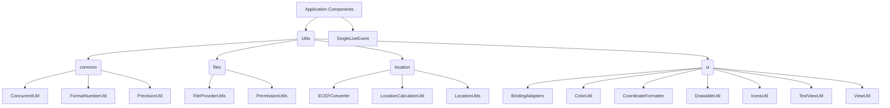

# Utils Package Explanation

This package provides various utility classes and functions used across the GpxAnalyzer application. These utilities are grouped into sub-packages based on their functionality.

## Components

*   **`SingleLiveEvent.java`**: A `LiveData` subclass that ensures an event (value update) is delivered only once to a single active observer after subscription. This is ideal for one-time events like navigation triggers or Snackbar messages, preventing them from being re-delivered upon observer re-subscription (e.g., after a configuration change).

### `common` sub-package
Contains general-purpose utility classes.
*   **`ConcurrentUtil.java`**: Provides a helper method `tryToDispose(Disposable disposable)` for safely disposing of RxJava `Disposable` objects, checking for null and prior disposal to prevent errors.
*   **`FormatNumberUtil.java`**: Utilities for formatting numbers, for display purposes (e.g., decimal places, units).
*   **`PrecisionUtil.java`**: Helper functions for performing floating-point number comparisons (e.g., `isEqualNDigitsPrecision`, `isGreaterEqual`) and rounding (`roundToNDigits`) with a specified number of decimal digits, mitigating common floating-point arithmetic inaccuracies.

### `files` sub-package
Contains utilities related to file handling and permissions.
*   **`FileProviderUtils.java`**: Provides utility methods for file operations primarily concerning the application's internal storage. This includes copying content from a `Uri` (e.g., obtained via a file picker) into the app's private files directory, retrieving files by extension from this directory, and saving string content to a file in this directory. It also includes a helper to get a filename from a content `Uri`.
*   **`PermissionUtils.java`**: Helper classes for managing Android runtime permissions, especially for accessing files or location.

### `location` sub-package
Contains utilities specifically for location-based calculations and operations.
*   **`ECEFConverter.java`**: Converts coordinates between Geodetic (Latitude, Longitude, Altitude) and Earth-Centered, Earth-Fixed (ECEF) coordinate systems.
*   **`LocationCalculatorUtil.java`**: Provides functions for various location-based calculations (e.g., distance, bearing, speed).
*   **`LocationUtils.java`**: General utility functions related to location data.

### `ui` sub-package
Contains utility classes to assist with UI-related tasks.
*   **`BindingAdapters.java`**: Custom binding adapters for use with Android Data Binding, allowing custom logic for setting view attributes in XML layouts.
*   **`ColorUtil.java`**: Utilities for working with colors, such as parsing, converting, or generating colors.
*   **`CoordinateFormatter.java`**: Formats geographical coordinates (latitude/longitude) into human-readable strings.
*   **`DrawableUtil.java`**: Utilities for working with Android `Drawable` objects (e.g., tinting, resizing).
*   **`IconsUtil.java`**: Helper functions for managing or displaying icons.
*   **`TextViewUtil.java`**: Utilities specific to `TextView` manipulation or styling.
*   **`ViewUtil.java`**: General utility functions for working with Android `View` objects.

## Architecture

The `utils` package is a collection of stateless helper classes and functions. They do not maintain their own state but provide reusable logic that can be called from various parts of the application. This promotes code reuse and separation of concerns by isolating common functionalities.

*(Diagram shows application components utilizing various utility classes grouped by functionality.)* 